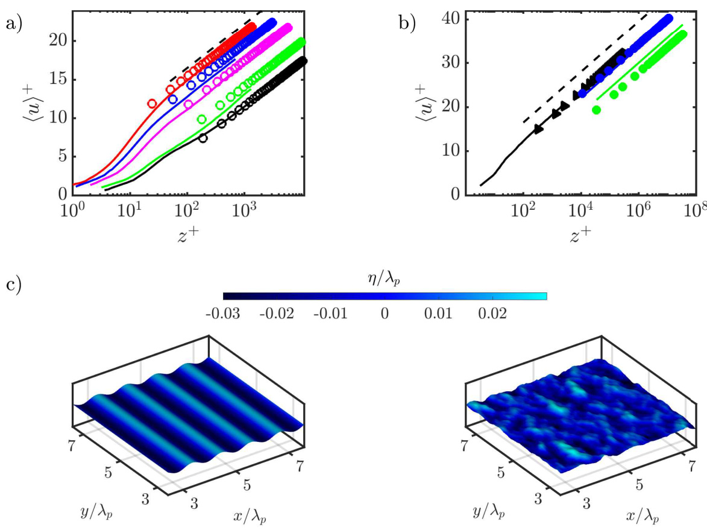
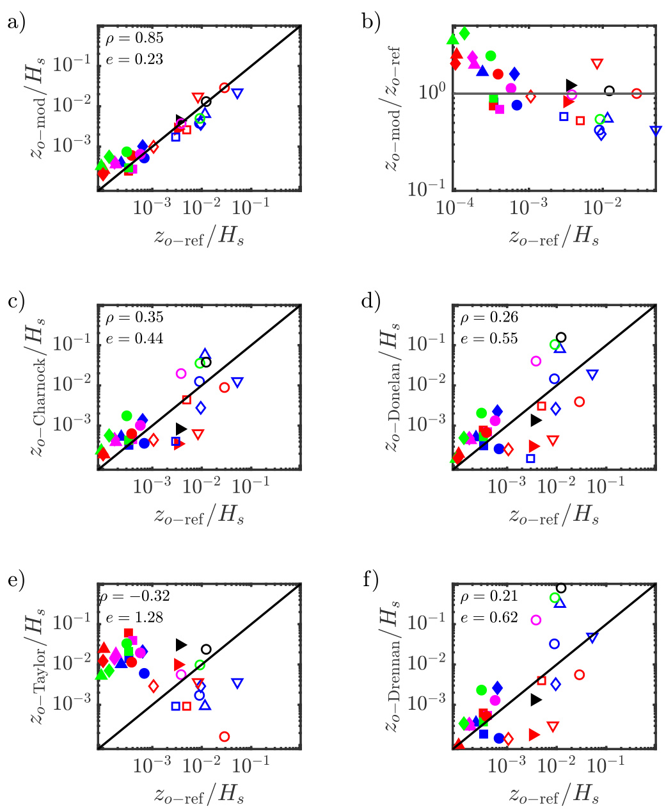
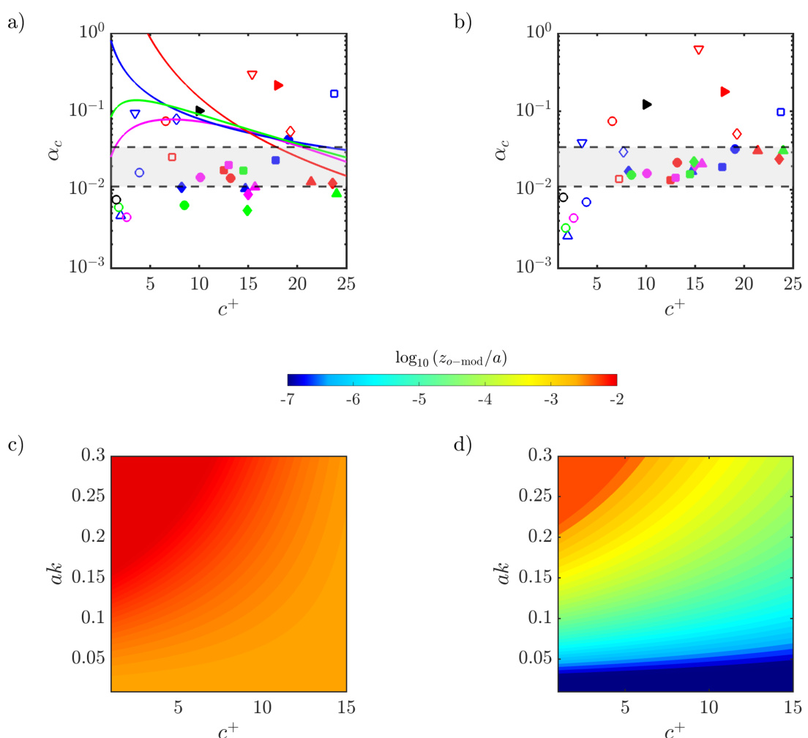

# Surface Wave-Aerodynamic Roughness Length Model for Air-Sea Interactions  

Manuel Ayala $^{1}$ , Dennice F. Gayme1, and Charles Meneveau1  

$^{\mathrm{~1~}}{}$ Department of Mechanical Engineering, Johns Hopkins University, Baltimore, USA  

# Key Points:  

• Introduces a fluid mechanics-inspired surface roughness model for turbulent flow over moving ocean waves using wave height distribution maps   
• Validates the model predictions against experimental and simulation data, results show improved accuracy over traditional empirical models.   
• Casts results in terms of the familiar Charnock coefficient that can now incorporate  

# Abstract  

A recently introduced model to evaluate the equivalent hydrodynamic length scale $z_{0}$ for turbulent flow over static rough surfaces is reformulated and extended to enable evaluation of $z_{0}$ for moving surface waves. The proposed Surface Wave-Aerodynamic Roughness Length model is based on maps of the surface height and its vertical speed as function of position, and Reynolds number. Pressure drag is estimated by approximating the local flow as ideal inviscid ramp flow (Ayala et al., 2024). Wave history effects are included through dependence on the local velocity difference between the air and wave speed. The model is applied to monochromatic and multiscale surfaces, and the predicted surface roughness length scales are compared to measured values and to commonly used wave parametrization methods found in the literature. The proposed model shows significantly improved agreement with data compared to other models.  

# Plain Language Summary  

This paper introduces a new method to predict the surface drag force imposed on wind blowing over ocean surface waves. Drag prediction methods are needed for weather prediction, climate modeling, and to support engineering tasks e.g., in offshore wind energy applications. The drag force is typically parameterized using a length-scale called the roughness scale; a measure of the resistance to the wind at the wind-wave interface due to moving surface waves. Traditional methods to evaluate this roughness scale rely on data-fitting or assumptions that often do not sufficiently capture the underlying physics. This study introduces a new physics-based approach that predicts the roughness scale based on geometric knowledge about the moving surface. The model is tested on simple and complex wave shapes. Predictions show agreement with data that is significantly better than traditional methods. The model can help improve simulations used for weather forecasting, hurricane prediction, climate modeling, and offshore wind farm design.  

# 1 Introduction  

Accurate prediction of the fluxes between the air and sea is essential for advancing weather forecasting, climate studies (Cronin et al., 2019), and offshore wind energy (Veers et al., 2023). However, developing accurate and practical parameterizations of airsea surface fluxes remains challenging due to the inherent complexity of atmospheric boundary layer (ABL) turbulence. Similar to static surface roughness, moving waves play a critical role in shaping the momentum balance between turbulent flows and underlying surfaces (Sullivan & McWilliams, 2010; Chung et al., 2021). However, unlike static roughness elements that are fixed, wave fields move, and are characterized by local phase and orbital velocities that affect the air flow above. Nonetheless, flow over both surfaces often result in logarithmic (or Monin-Obukov similarty theory based) profiles of the mean air velocity, at sufficiently high Reynolds number. Therefore, the averaged wave effects can be similarly represented with an equivalent hydrodynamic length scale, $z_{0}$ (Deskos et al., 2021). Determining this scale based on information about the surface without having to perform costly experiments or eddy-resolving numerical simulations remains an open question.  

In the case of static surface roughness, determination of $z_{0}$ utilizes topographical parameters that depend solely on the geometry of the surface (Chung et al., 2021). Approaches for estimating equivalent roughness length scales a priori have been developed with some success using empirical fit models (Flack & Chung, 2022), machine learning approaches (Aghaei Jouybari et al., 2021), and more recently, a fluid mechanics-based geometric parameter called the wind-shade factor (Meneveau et al., 2024). On the other hand, due to the inherently time-varying nature of waves, most approaches for determining equivalent surface roughness for surface waves rely heavily on empirical fits to available data (Deskos et al., 2021). Several widely used parameterizations include the Charnock model (Charnock, 1955), the Donelan model (Donelan, 1990), the Taylor model (Taylor & Yelland, 2001), and the Drennan model (Drennan et al., 2003). The Charnock model relates roughness length to wind stress, while the Donelan and Drennan models focus on wave age and amplitude. The Taylor model emphasizes wave steepness instead of wave age. For a more comprehensive discussion of these and other models, we refer to (Zhao & Li, 2024). Mesoscale simulations of offshore wind farms (Jim´enez et al., 2015) and hurricane modeling (Davis et al., 2008) employ such models within the Weather Research and Forecasting (WRF) framework. Global climate models also use such parameterizations to represent surface fluxes (Couvelard et al., 2020). Similarly, Large Eddy Simulations (LES) of microscale meteorological boundary layers using WRF-LES (MunozEsparza et al., 2014; Ning et al., 2023) or LES of offshore wind turbine flows (Johlas et al., 2020; H. Yang, Ge, Abkar, & Yang, 2022) have used $z_{0}$ -models to capture wave-induced effects. While existing models for $\zeta0$ have yielded useful results, they often lack robustness across diverse wave conditions (Cronin et al., 2019), motivating the search for more universal models that can generalize across varying wave fields while reducing reliance on tuning coefficients.  

In this Letter we describe a new method to determine $z_{0}$ for a given moving wavefield. The proposed Surface Wave-Aerodynamic Roughness Length (SWARL) model uses a physics-based approach that requires only maps of a wave field’s spatial distribution of surface heights at two successive times, and the relevant Reynolds number as inputs. A scalar parameter, $\Lambda$ , is then evaluated numerically (or analytically when possible) as a surface average of geometric surface properties. An iterative procedure is used to capture dependence on wave age and Reynolds number. The proposed model is validated against data and existing models for monochromatic and multiscale waves.  

# 2 Surface Wave-Aerodynamic roughness length model  

We begin by expressing the momentum exchange (total drag force on planform area $A$ ) as an integral of a surface stress, $\tau_{x z}^{\mathrm{w}}$ , accowr-dping to $\iint_{A}\tau_{x z}^{\mathrm{w}}~d x d y=u_{*}^{2}A$ , where $u_{*}$ is tphree sfsruicrtei o(fno rvmel odcriatyg.) $\tau_{x z}^{\mathrm{w-p}}$ ,w aanlld s tvriesscso $\tau_{x z}^{\mathrm{w}}\;=\;\tau_{x z}^{\mathrm{w-p}}\,+\,\tau_{x z}^{\mathrm{w-\nu}}$ rocoungshinstess so fd rtawgo $\tau_{x z}^{\mathrm{w}-\nu}$ ,r itbhuet iloantts:er from surface features smaller than the resolved ones causing pressure stress.  

The pressure stress is modeled using the wall stress model for moving surfaces introduced in Ayala et al. (2024), in which wave-resolving effects are included through an LES boundary condition rather than a wave-phase adapting computational grid. The model assumes that in the frame of the wave’s local phase speed $\mathbf{C}$ with incoming relative velocity $\mathbf{u}_{\Delta}{-}\mathbf{C}$ (where $\mathbf{u}_{\Delta}$ is the air velocity at some reference height $\Delta$ above the wave mean elevation), the local flow can be represented as potential flow over a ramp with slope angle $\alpha$ . The average pressure over such a ramp is proportional to the relative velocity squared and $\alpha/(\pi\!+\!\alpha)$ and the pressure contribution (form drag) to the modeled stress can be written as  

$$
\tau_{i z}^{\mathrm{w-p}}=\frac{\alpha}{\pi\,+\,\alpha}\,\vert(u_{\Delta}-C)\cdot\hat{n}\vert^{2}\,\vert\nabla\eta\vert\,\operatorname{H}\,[(u_{\Delta}-C)\cdot\nabla\eta]\,\,\hat{n}_{i}\qquad i=1,2.
$$  

Here $\eta(x,y,t)$ is the known surface height distribution as function of horizontal positions $(x,y)\ =\ (x_{1},x_{2})$ and time $t$ , $\alpha\;=\;\arctan|\nabla\eta|$ , and $c$ is the local phase-velocity of the wave, i.e., the horizontal speed of the surface’s local vertical projection can be computed from $\eta(x,y,t)$ (Ayala et al., 2024), as  

$$
C_{i}=-\frac{\partial\eta}{\partial t}\,\frac{\partial\eta}{\partial x_{i}}\,\frac{1}{|\nabla\eta|^{2}}\,.
$$  

(Note that there are points for which , $C_{i}$ diverges, since $|\nabla\eta|$ is in the denominator of (2), but at any of these points $\alpha=0$ and $\partial h/\partial x=0$ , so there are no singularities when evaluating $\tau^{\mathrm{w-p}}$ .) The local surface unit normal in the horizontal plane is given by $\hat{n}_{i}=$ $(\partial\eta/\partial x_{i})/|\boldsymbol{\nabla}\eta|$ (i=1,2). In Ayala et al. (2024) it was assumed that displacement of the streamlines causes a pressure drop or prevents pressure recovery on the leeside of the wave, such that the pressure force there can be neglected. So, the Heaviside function $\mathrm{H}(x)=$ ${\scriptstyle{\frac{1}{2}}}(x+|x|)/x$ is used to impose the pressure force only on the faceward side of the wave.  

Instead of following Ayala et al. (2024) in which the reference velocity $u_{\Delta}$ was taken at a vertical distance equal to the horizontal LES grid spacing $\Delta x$ , we assume the reference velocity $\mathbf{u}_{\Delta}$ is a constant representing the mean air velocity at a height $\Delta$ , some sufficiently far fixed distance above the wave field. Following Meneveau et al. (2024) $\Delta$ is set to a multiple of the roughness (wave) amplitude. Since the mean velocity reference $\mathbf{u}_{\Delta}$ is assumed constant, without loss of generality we may align the $x$ axis with this mean air velocity (i.e. $\mathbf{u}_{\Delta}~=~u_{\Delta}\mathbf{i}$ , and $\nu_{\Delta}~=~0$ ). Then, realizing that $\hat{n}_{i}$ and $\mathbf{v}\eta$ are in the same direction, we can expand equation $^{1}$ , rearrange and simplify to obtain the resulting kinematic wall stress in the $x$ -direction:  

$$
\tau_{x z}^{\mathrm{w-p}}=u_{\Delta}^{2}\left\{\frac{\alpha}{(\pi\,+\,\alpha)}\;\left(\left[\left(1-\frac{C_{x}^{+}}{u_{\Delta}^{+}}\right)\,\hat{n}_{x}\right]^{2}+\left[\frac{C_{y}^{+}}{u_{\Delta}^{+}}\hat{n}_{y}\right]^{2}\right)\;\frac{\partial\eta}{\partial x}\;\mathrm{H}\left[\left(1-\frac{C_{x}^{+}}{u_{\Delta}^{+}}\right)\,\hat{n}_{x}\right]\right\},
$$  

where the subscript $(\cdot)^{+}$ denotes normalization with friction velocity $u_{*}$ . To model $\tau_{x z}^{\mathrm{w}-\nu}$ , i.e., tangential viscous stress contributions as well as unresolved surface form drag effects, we use a friction factor $C_{f}$ model:  

$$
\tau_{x z}^{\mathrm{w}-\nu}=\frac{1}{2}~C_{f}(R e_{\Delta},z_{0}^{u})~u_{\Delta}^{2}.
$$  

The friction factor $C_{f}$ can be determined using the generalized Moody diagram fit (Meneveau, 2020), that depends on $R e_{\Delta}=u_{\Delta}\Delta/\nu=u_{\Delta}^{+}\,\Delta^{+}$  

$$
C_{f}(R e_{\Delta},z_{0}^{u})=2\,\left[\left(\frac{1}{2}C_{f s}(R e_{\Delta})\right)^{3}+\left(\frac{1}{\kappa}\log\frac{\Delta}{z_{0}^{u}}\right)^{-6}\right]^{1/3}.
$$  

Here $C_{f s}(R e_{\Delta})$ is the smooth surface friction coefficient $C_{f s}(R e_{\Delta})$ which has been fitted to results from numerical integration of the equilibrium model differential equation (Meneveau 2020). The fit in it’s simplest form (as also used in Meneveau et al. (2024)) is given by $C_{f s}(R e_{\Delta})\,=\,0.0288\,R e_{\Delta}^{-1/5}\,(1+577\,R e_{\Delta}^{-6/5})^{2/3}$ , where $\kappa\:=\:0.4$ is the von Karman constant. Moreover, $\Delta^{+}=\Delta u_{*}/\nu$ so for any given $u_{*}$ it can be computed knowing the height $\Delta$ and fluid viscosity $\nu$ . The second term in Eq. (5) represents the effects of unresolved small-scale sea surface features such as capillary waves that cannot be evaluated numerically on the surface discretization grid. The drag from these unresolved surface features is included $C_{f}$ by means of a small-scale roughness length $z_{0}^{u}$ . This length can be expressed in terms of the root-mean-square surface fluctuations below the resolution with which $\eta$ is known, using the result from Geva and Shemer (2022):  

$$
z_{0}^{u}=\eta_{\mathrm{sgs}}^{\prime}\,e^{-8.5\kappa}.
$$  

where $\eta_{\mathrm{sgs}}^{\prime}$ is the root mean square of the sub-grid surface height distribution. The $z_{0}^{u}$ - dependent term in Eq. (5) vanishes for surfaces that are known to be smooth below the resolved elevation field $\eta(x,y,t)$ ( $z_{0}^{u}\to0$ ).  

The total horizontal drag is given by  

$$
u_{*}^{2}\,A=\langle\tau_{x z}^{\mathrm{w}-p}+\tau_{x z}^{\mathrm{w}-\nu}\rangle_{x,y}\,A=u_{\Delta}^{2}\,\Lambda\,A\quad\Rightarrow\quad u_{\Delta}^{+}=\Lambda^{-1/2},
$$  

where, similarly to the definition of the “wind-shade factor” of Meneveau et al. (2024), we define the factor $\Lambda$ implicitly according to  

$$
\Lambda=\left\langle\frac{\alpha}{\pi+\alpha}\ \left(\left[(1-C_{x}^{+}\Lambda^{1/2})\,\widehat{n}_{x}\right]^{2}+\left[C_{y}^{+}\Lambda^{1/2}\,\widehat{n}_{y}\right]^{2}\right)\ \frac{\partial\eta}{\partial x}\ \mathrm{H}\left[(1-C_{x}^{+}\,\Lambda^{1/2})\widehat{n}_{x}\right]\right\rangle_{x,y}+\frac{1}{2}\,C_{f},
$$  

where $C_{f}=C_{f}(\Lambda^{-1/2}\Delta^{+},z_{0}^{u})$ and we have used $u_{\Delta}^{+}=\Lambda^{-1/2}$ so that $R e_{\Delta}=u_{\Delta}^{+}\Delta^{+}=\Lambda^{-1/2}\Delta^{+}$ . The slope $\partial\eta/\partial x$ , angle $\alpha$ , local surface normal vector $\hat{n}_{i}$ , and local phase speeds $C_{i}$ are all quantities that depend on position $(x,y)$ and time. If the area $A$ is large enough, the planar averaging over $x y$ , denoted by brackets $\langle\cdot\rangle_{x,y}$ , is expected to converge to a well defined value of $\Lambda$ even for a single snapshot of a realization of the wave field (however, note that to determine $\mathbf{C}$ the vertical surface speed $\partial\eta/\partial t(x,y)$ is also required). Solving for $\Lambda$ requires averaging over a known surface elevation map $\eta(x,y,t)$ numerically (except for some monochromatic waves, as discussed below). For a given value of $\Lambda$ (or $u_{\Delta}^{+}$ ) obtained during an iteration step from Eq. (8), the roughness length $z_{0}$ can be determined from $u_{\Delta}^{+}=\kappa^{-1}\,\ln{(\Delta/z_{0})}$ , leading to:  

$$
z_{0}=\Delta\exp\left[-\kappa\,\Lambda^{-1/2}\right].
$$  

The reference height $\Delta$ is chosen following Meneveau et al. (2024), as $\Delta=3H_{p}^{\prime}$ , where the typical dominant positive height of the surface $H_{p}^{\prime}$ is defined and computed as $H_{p}^{\prime}=$ $\langle[\operatorname*{max}(0,\eta^{\prime})]^{8}\rangle^{1/8}$ where $\eta^{\prime}=\eta\!-\!\langle\eta\rangle$ is the surface elevation relative to the mean. This dominant height, $H_{p}^{\prime}$ , approximately represents the maximum positive deviation above the mean surface height and is closely related to typical characteristic wave heights, such as the significant wave height $H_{s}$ . The choice of $H_{p}^{\prime}$ ensures a consistent measure of the “typical” or representative maximum positive wave height across different wave conditions.  

If the friction Reynolds number $R e_{\tau}\;=\;u_{*}h/\nu$ is imposed (as is often the case in numerical simulations), for a known boundary layer hight $h$ and air viscosity $\nu$ , the value of $u*$ can be specified a priori. Since for a given surface the local phase speed $C_{i}$ can be determined locally at each point, the dimensionless value $C_{i}^{+}=C_{i}/u_{*}$ can be evaluated at each point of the surface and used in the evaluation of $\Lambda$ . (For numerical convenience we clip the phase velocity $C_{i}$ when $|\nabla\eta|$ tends to zero in Eq. 2 to $|\mathbf{C}|_{\mathrm{max}}=\sqrt{g/0.25k_{p}}$ , where $g=9.81\mathrm{m/s}$ . Using $0.25k_{p}$ ensures that the cutoff corresponds to spe eds significantly faster than the fastest expected waves, of a size 4 $\times$ the most dominant wavelength.) In many cases, however, $u_{*}$ may not be known $a$ priori but instead we may know the air velocity $U(h_{r})$ at some reference height $h_{r}$ (e.g., the common choice $h_{r}=10\mathrm{m}$ ). In that case we may start with some initial guess for $u_{*}$ , evaluate $\Lambda$ using Eq. (8), then evaluate $u_{*}\,=\,\kappa U(h_{r})/\mathrm{log}(h_{r}/z_{0})\,=\,\kappa U(h_{r})/[\log(h_{r}/\Delta)$ + 휅Λ−1/2]. With a new value for $u_{*}$ thus determined, a next value of $\Lambda$ is computed, using Eq. (8). Once converged, the final value of $z_{0}$ is determined using Eq. (9).  

# 3 Results  

We apply the proposed model to several cases with known full surface distribution $\eta(x,y,t)$ and specified turbulent friction Reynolds number (or friction velocity $u_{*}$ ) or some reference air velocity. For the iterative procedure to determine $\Lambda$ and $z_{0}$ , we use a NewtonRahpson method to obtain a converged solution of Eq. (8) using a tolerance of $10^{-6}$ .  

For monochromatic waves of the form $\eta=a\,\cos(k x\!-\!\omega t)$ with small $(a k)$ values, the calculation of $\Lambda$ can be simplified: With $\alpha\ll\pi$ and $\alpha\approx\partial\eta/\partial x,\,\alpha/(\pi\!+\!\alpha)\approx\pi^{-1}\partial\eta/\partial x$ , $C=\omega/k=c$ constant everywhere, and a spatially constant wave-history term $1{-}C_{x}^{+}{\sqrt{\Lambda}}$ . Noting that the average of $(\partial\eta/\partial x)^{2}$ over half wavelength (since only the forward-facing side generates drag as discussed above) is $\begin{array}{r}{\lambda^{-1}\int_{\lambda/2}^{\lambda}(a k)^{2}\sin^{2}(k x)d x=(1/4)(a k)^{2}}\end{array}$ , we obtain:  

$$
\Lambda=\frac{(a k)^{2}}{4\pi}~\left(1-C_{x}^{+}\,\sqrt{\Lambda}\right)^{2}~+~\frac{1}{2}~C_{f}(\Lambda^{-1/2}\Delta^{+},0).
$$  

Note that the simplified model is expected to lose validity for wave steepness greater than about $a k~\sim~0.28$ ( $16^{\circ}$ degrees) because of the small angle approximation $\alpha\ \ <<$ $\pi$ . For more realistic multiscale wavefields such as ocean waves with a known spectrum, realizations of the wave height $\eta(x,y,t)$ can be generated by the usual method of superposing random-phase traveling waves with a prescribed surface spectrum $S(k_{x},k_{y})$ such as the JONSWAP spectrum (K. Hasselmann et al., 1973), a spreading function $D(\theta)$ , and a dispersion relation $\omega(k)$ .  

Table 1 shows the series of monochromatic and multiscale wave field cases the model is applied to. For both wave types, we select cases that have been previously studied in high-resolution experiments (Buckley et al., 2020; Yousefi et al., 2020), wave-resolved simulations (Wang et al., 2021; Hao et al., 2021; Zhang et al., 2019; Cao & Shen, 2021; D. Yang et al., 2013) and experimental field campaigns (Drennan et al., 2003; Janssen, 1997; Romero & Melville, 2010; Johnson et al., 1998). The wind and wave were aligned in the multiscale wave cases from the field campaigns.  

Since typically only the peak wavenumber ( $k_{p}$ ) was reported, we generate the multiscale surface utilizing a standard default wave spectrum model. The Janssen (1997); Johnson et al. (1998) cases reported using the Pierson-Moskowitz (P-M) model (Pierson Jr. & Moskowitz, 1964) to characterize their wave spectrum, therefore we also use the PM model to generate surfaces for these cases:  

$$
S_{p m}(k_{x},k_{y})=\frac{\alpha_{p}}{2k^{4}}\exp\left[-\frac{5}{4}\left(\frac{k_{p}}{k}\right)^{2}\right]D(\theta),
$$  

where $\alpha_{p}$ is the Phillips constant. We prescribe some directionality by adopting a widely used spreading function (D. E. Hasselmann et al., 1980; Cartwright, 1963) $D(\theta)=(2/\pi)\cos^{2}\theta$ if $|\theta|\,\leq\,\pi/2$ , where $\theta=\arctan{(k_{\mathrm{y}}/k_{x})}$ . For cases where no spectrum model was mentioned in the prior studies, we use the JONSWAP spectrum:  

$$
S_{j}(k_{x},k_{y})=S_{p m}~3.3^{\gamma},
$$  

where $\gamma~=~\exp{[-1/(2\varepsilon^{2})(\sqrt{k/k_{p}}-1)^{2}]}$ , $\varepsilon$ is a parameter and the same $D(\theta)$ is used. Since the Phillips paramete r was not reported in the field campaign cases, we use $\alpha_{p}=$ $0.006(U_{10}/c_{p})^{0.55}$ as given by (Donelan et al., 1985), where $U_{10}$ is the velocity measured at $10~\mathrm{m}$ height. Since using conventional grid resolutions to generate the surface will make the surface inherently filtered at the grid resolution, we include drag effects of the subfilter features using equation 6.  

The r.m.s of the sub-filter features $(\eta_{\mathrm{sgs}}^{\prime})$ is evaluated by integrating the one-dimensional form of Eq. (11) from $k_{\Delta}$ to infinity, resulting in:  

$$
\eta_{\mathrm{sgs}}^{\prime}\;=\;\frac{\sqrt{0.2\alpha_{p}}}{k_{p}}\left(1-\exp\left[-\frac{5}{4}\left(\frac{k_{p}}{k_{\Delta}}\right)^{2}\right]\right)^{1/2}.
$$  

The monochromatic wave cases were generated using $\eta~=~a\,\cos(k x\,-\,\omega t)$ as the surface. While for many of these cases the simplified expression Eq. (10) could be used, in some cases the wave steepness exceeded 0.28. So, for procedural consistency and testing purposes, all wave surfaces were generated numerically. The numerically generated surfaces used a $1280\times1280$ grid with domain size $L_{x}~=~L_{y}~=~10\lambda_{p}$ . Two successive times separated by a small $\Delta t=0.001$ sec were stored. A grid-dependence study using the current methodology found no significant changes in the results using finer grid resolutions. Spatial and temporal gradients of all surfaces were computed using simple firstorder finite differencing. None of the wave cases examined in this study exceeded the swel condition of $c_{p}^{+}>25$ . A study of the model’s applicability for swell conditions and further modification of the model to include these effects is left for future work.  

We first focus on the logarithmic mean wind velocity profiles above the wave field for some representative cases of monochromatic and multiscale wave fields. Figure 1a shows measured mean velocity profiles from a laboratory experiment (Buckley et al., 2020; Yousefi et al., 2020) (lines) and corresponding logarithmic profile $1/\kappa\ln{(z/z_{0})}$ with the  

Table 1. Wave and flow parameters for all cases. Open symbols are monochromatic waves and filled symbols are multiscale waves. Case “W” is from Wang et al. (2021), cases “H” from Hao et al. (2021), cases “Z” from Zhang et al. (2019), cases “B” from Buckley et al. (2020) and “B5” from Yousefi et al. (2020), cases “C” from Cao and Shen (2021), cases “Y” from D. Yang et al. (2013), cases “D” from Drennan et al. (2003), cases “J” from Janssen (1997), cases “R” from Romero and Melville (2010) and cases “S” from Johnson et al. (1998).   

<html><body><table><tr><td>Case</td><td>Qp X103</td><td>Hskp (ak)</td><td>d</td><td>Re x 10-4</td><td>z0-ref × 103 Hs</td><td>z0-mod × 103 Hs</td><td>Symbol</td></tr><tr><td>W1</td><td></td><td>(0.10)</td><td>2.00</td><td>0.11</td><td>11.6</td><td>6.4</td><td>△</td></tr><tr><td>H1</td><td></td><td>(0.14)</td><td>19.3</td><td>0.50</td><td>10.6</td><td>10.0</td><td></td></tr><tr><td>H2</td><td>-</td><td>(0.14)</td><td>7.70</td><td>0.50</td><td>9.54</td><td>3.66</td><td></td></tr><tr><td>Z1</td><td></td><td>(0.10)</td><td>7.25</td><td>0.11</td><td>4.96</td><td>2.61</td><td>口</td></tr><tr><td>Z2</td><td></td><td>(0.10)</td><td>23.8</td><td>0.11</td><td>2.97</td><td>1.73</td><td>口</td></tr><tr><td>B1</td><td></td><td>(0.06)</td><td>6.57</td><td>0.13</td><td>28.8</td><td>28.9</td><td>O</td></tr><tr><td>B2</td><td></td><td>(0.12)</td><td>3.91</td><td>0.30</td><td>9.00</td><td>3.80</td><td></td></tr><tr><td>B3</td><td></td><td>(0.17)</td><td>2.62</td><td>0.58</td><td>3.82</td><td>3.72</td><td>O</td></tr><tr><td>B4</td><td></td><td>(0.20)</td><td>1.80</td><td>0.99</td><td>9.20</td><td>5.00</td><td>O</td></tr><tr><td>B5</td><td></td><td>(0.26)</td><td>1.53</td><td>1.04</td><td>14.8</td><td>12.3</td><td></td></tr><tr><td>C1</td><td></td><td>(0.15)</td><td>3.46</td><td>0.04</td><td>52.4</td><td>22.2</td><td></td></tr><tr><td>C2</td><td></td><td>(0.15)</td><td>15.4</td><td>0.04</td><td>8.40</td><td>17.5</td><td>△</td></tr><tr><td>Y1</td><td>19.0</td><td>0.28</td><td>10.0</td><td>33.0</td><td>3.60</td><td>4.38</td><td></td></tr><tr><td>Y2</td><td>13.0</td><td>0.20</td><td>18.0</td><td>33.0</td><td>3.30</td><td>2.73</td><td></td></tr><tr><td>D1</td><td>7.06</td><td>0.20</td><td>14.7</td><td>397</td><td>0.235</td><td>0.391</td><td>■</td></tr><tr><td>D2</td><td>7.81</td><td>0.26</td><td>21.4</td><td>280</td><td>0.105</td><td>0.264</td><td>■</td></tr><tr><td>D3</td><td>8.04</td><td>0.24</td><td>15.7</td><td>410</td><td>0.183</td><td>0.362</td><td>▼</td></tr><tr><td>D4</td><td>6.14</td><td>0.17</td><td>24.0</td><td>162</td><td>0.093</td><td>0.328</td><td></td></tr><tr><td>J1</td><td>7.20</td><td>0.22</td><td>17.8</td><td>371</td><td>0.336</td><td>0.275</td><td>■</td></tr><tr><td>J2</td><td>7.75</td><td>0.34</td><td>12.5</td><td>581</td><td>0.330</td><td>0.247</td><td>■</td></tr><tr><td>J3</td><td>7.83</td><td>0.30</td><td>13.0</td><td>581</td><td>0.402</td><td>0.277</td><td>■</td></tr><tr><td>J4</td><td>7.40</td><td>0.25</td><td>14.5</td><td>432</td><td>0.332</td><td>0.298</td><td>■</td></tr><tr><td>R1</td><td>10.9</td><td>0.25</td><td>8.20</td><td>498</td><td>0.637</td><td>1.02</td><td></td></tr><tr><td>R2</td><td>6.24</td><td>0.21</td><td>23.6</td><td>381</td><td>0.101</td><td>0.206</td><td>?</td></tr><tr><td>R3</td><td>7.96</td><td>0.22</td><td>15.0</td><td>465</td><td>0.172</td><td>0.405</td><td>?</td></tr><tr><td>R4</td><td>8.46</td><td>0.18</td><td>14.9</td><td>344</td><td>0.134</td><td>0.560</td><td>?</td></tr><tr><td>S1</td><td>6.85</td><td>0.17</td><td>19.1</td><td>113</td><td>0.687</td><td>0.523</td><td>.</td></tr><tr><td>S2</td><td>8.02</td><td>0.21</td><td>13.2</td><td>187</td><td>0.382</td><td>0.606</td><td>.</td></tr><tr><td>S3</td><td>9.77</td><td>0.25</td><td>10.1</td><td>293</td><td>0.572</td><td>0.648</td><td></td></tr><tr><td>S4</td><td>11.2</td><td>0.29</td><td>8.50</td><td>346</td><td>0.744</td><td>0.336</td><td></td></tr></table></body></html>  

  
Figure 1. Comparison of mean streamwise velocity profiles for cases (a) B1-5 and (b) Y1, S1 S4. SWARL model (symbols) and reference data (colored lines). Dashed line corresponds to the smooth surface case. Symbols follow table 1. (c): Realizations of surface elevation maps for cases B3, Y1.  

values of $z_{0}$ as determined using the SWARL model (symbols). Figure 1b shows a similar comparison for multiscale wave fields based on cases Y1, S1 and S4. Realizations of surface elevation maps for cases B3 and Y1 are shown in figure 1c. The results demonstrate good agreement between the model predictions and the reference data. For a more complete comparison of the model’s predictive strength, figure 2a and 2b show scatter plots of modeled surface roughness versus reference data. The surface roughness from the reference cases are either provided or are obtained by taking the reference velocity profiles and fitting the log law region with a least square method. For some of the experimental cases, the surface roughness was estimated using $z_{0-\mathrm{ref}}=h_{10}\exp\left(-\kappa/\sqrt{C_{D}}\right)$ , where $h_{10}$ is $10\;\mathrm{m}$ and $C_{D}=(u_{*}/U_{10})^{2}$ . For all wave types, there is good overall agreement between the predicted and measured values. The correlation coefficient for our model is about $85\%$ and we also estimate the average logarithmic error magnitude $e=\langle|\log_{10}(z_{0-\mathrm{mod}}/z_{0-\mathrm{ref}})|\rangle$ to be around $e=0.23$ .  

Next, we compare to several commonly used $\zeta0$ -parameterizations in the literature. The Charnock model remains the most widely used parameterization for air-sea momentum transfer, with applications in fields such as hurricane modeling (Davis et al., 2008) and offshore wind energy (Johlas et al., 2020; H. Yang, Ge, Gu, et al., 2022). It is expressed as:  

$$
z_{0-\mathrm{Charnock}}=\alpha_{c}\,\frac{u_{*}^{2}}{g}=\frac{\alpha_{c}}{k_{p}(c_{p}^{+})^{2}},
$$  

where $c_{p}^{+}$ is the phase speed of the peak wave, and $\alpha_{c}$ is the Charnock coefficient. This coefficient is reported to vary between 0.011 and 0.035, (Deskos et al., 2021). For the comparison we use $\alpha_{c}=0.023$ , which reflects the center of the reported range. We also provide comparisons with the Donelan model (Donelan, 1990): $z_{0-\mathrm{Donelan}}=0.46\,H_{s}\left(c^{+}\right)^{-2.53}$ , the Taylor-Yelland model (Taylor & Yelland, 2001): $\zeta_{\mathrm{0-Taylor}}=1200\,H_{s}\,\,(a k/2\pi)^{s.4}$ , and the Drennan model (Drennan et al., 2003): $z_{0-\mathrm{Drennan}}~=~3.35\,H_{s}\,(c^{+})^{-{\it3.4}}$ . The corresponding scatter plots and the correlation coefficients and logarithmic errors are shown in figure 2c-f. Here, the Charnock model shows the strongest overall correlation with observations with a correlation coefficient of 37%. However, as discussed above the proposed SWARL model significantly exceeds this accuracy, yielding a correlation coefficient of $85\%$ , i.e., more than twice that of the Charnock model.  

In order to cast the comparison in terms of another common parameter, we also present results in terms of the effective (modified) Charnock coefficient:  

$$
\alpha_{c}=z_{0}\,k_{p}(c_{p}^{+})^{2}=(\Delta\,k_{p})\,(c_{p}^{+})^{2}\,\exp{\left[-\kappa\,\Lambda^{-1/2}\right]},
$$  

where the last equality is for the proposed model when $z_{0}$ is expressed in terms of $\Lambda$ and $\Delta$ . Although numerous formulations exist for $\alpha_{c}$ , each parameterized by wave properties, no universal formulation has been established. Most are derived from data fitting (Zhao & Li, 2024; Lin & Sheng, 2020). The modified Charnock coefficient was calculated for all wave cases shown in Table 1 and the results from data (using the measured values of $\zeta0$ ) are plotted in figure 3a alongside results from the SWARL model using the same symbols in figure 3b. For comparison, four distinct formulations of the Charnock coefficient, all based solely on wave age ( $c^{+}$ ), are also shown as lines, which show poor agreement with the scattered data. In contrast, the values of the modified Charnock coefficient derived from the proposed model show the desired lack of one-to-one dependence or single scaling with wave age. Rather, the model incorporates dependency on additional parameters beyond wave age, namely wave steepness (capturing surface geometric effects) and wind conditions (via $R e_{\tau}$ ).  

Focusing on the case of monochromatic waves, the simplified model from Eq. (10) enables us to perform a broad parametric study over a range of flow parameters (mainly $R e_{\tau}$ ) and wave parameters ( $a k$ and $c^{+}$ ). Figures 3c,d, show contour plots of the modeled surface roughness for a range of wave parameters at $R e_{\tau}~=~10^{2}$ and $R e_{\tau}~=~10^{7}$ . The results show that for the low $R e_{\tau}$ , $\zeta0$ is proportionally a larger fraction of $a$ as compared to the high $R e_{\tau}$ case, and further confirm dependence of $\zeta0$ on multiple parameters, i.e., $(a k),\,c^{+}$ , and $R e_{\tau}$ .  

# 4 Conclusions  

This study introduces a surface roughness model for turbulent flow over moving ocean waves. Unlike traditional models that rely on small subsets of relevant parameters and empirical parameter tuning, the proposed model includes dependence on full geometric characteristics of the wave surface, offering more general applicability. For multiscale surfaces, discretized realizations of wave-height fields at two consecutive times are needed. For monochromatic and small amplitude waves, a simplified formulation is derived that enables $\zeta0$ prediction using only simple wave parameters such as amplitude, wavelength and phase speed. This simplified approach is particularly useful for parametric studies. We express the proposed model in terms of a modified Charnock coefficient that offers a more comprehensive representation of air-sea momentum exchange.  

The model’s performance is validated against monochromatic and multiscale wave fields, showing good agreement with experimental and simulation-based reference data. Comparisons with widely used empirical models demonstrate the superior accuracy and broader applicability of the proposed method across diverse wave conditions. The approach can thus enhance atmospheric boundary layer simulations in mesoscale and micromesoscale modeling frameworks, such as WRF-LES. Additionally, we envision that with in-situ measurements of wave height and wind velocity, the proposed model could provide an efficient means of determining surface momentum flux ( $u_{*}^{2}$ ) from wave surface measurements, offering practical utility in interpreting field data. Future work extending the model to account for the dynamics of swell conditions, wave breaking, modeling scalar fluxes, are fruitful future challenges beyond the scope of this study.  

  
Figure 2. (a) Surface roughness predicted by the model versus values from reference data for all cases. (b) Ratio of the modeled to measured surface roughness. (c, d, e, f) Surface roughness predicted by the four models versus values from reference data for all cases. Symbols follow table 1. Also indicated are the correlation coefficient and logarithmic errors between modeled and measured $z0$ values. For monochromatic wave cases, the surface roughness is normalized by the amplitude $a$ .  

  
Figure 3. Scatter plot of modified Charnock coefficient versus normalized wave velocity for (a) measured roughness lengths and (b) using equation 15. Symbols follow table 1. The shaded region represents the range of typical used Charnock constant values (0.011-0.038). Models from: $(-)$ : Maat (1991) , $(-)$ : Liu (2008), $(-)$ : Oost (2002), $(-)$ : Hwang (2005). (c) and (d): Contours of predicted surface roughness for monochromatic waves, using the simplified model (equation 10) at (c) $R e_{\tau}=10^{2}$ , and at (d) $R e_{\tau}=10^{7}$ .  

# Open Research Section  

Data files and Matlab code to compute the roughness scale can be downloaded from the repository at https://github.com/ayalamanuel/SWARL  

# Acknowledgments  

This work was supported by the National Science Foundation and the Department of Energy (via NSF grant CBET-2401013) and by the U.S. Department of Energy, Office of Science Energy Earthshot Initiative, as part of the Addressing Challenges in Energy—Floating Wind in a Changing Climate (ACE-FWICC) Energy Earthshot Research Center.  

# References  

Aghaei Jouybari, M., Yuan, J., Brereton, G. J., & Murillo, M. S. (2021). Datadriven prediction of the equivalent sand-grain height in rough-wall turbulent flows. Journal of Fluid Mechanics, 912 , A8. doi: 10.1017/jfm.2020.1085   
Ayala, M., Sadek, Z., Fercak, O., Cal, R. B., Gayme, D. F., & Meneveau, C. (2024). A moving surface drag model for les of wind over waves. Boundary-Layer Meteorology, 190 (10), 39.   
Buckley, M. P., Veron, F., & Yousefi, K. (2020). Surface viscous stress over winddriven waves with intermittent airflow separation. Journal of Fluid Mechanics, 905 , A31. doi: 10.1017/jfm.2020.760   
Cao, T., & Shen, L. (2021). A numerical and theoretical study of wind over fastpropagating water waves. Journal of Fluid Mechanics, 919 , A38. doi: 10.1017/ jfm.2021.416   
Cartwright, D. E. (1963). The use of directional spectra in studying the output of a wave recorder on a moving ship. Prentice Hall.   
Charnock, H. (1955). Wind stress on a water surface. Quarterly Journal of the Royal Meteorological Society, 81 (350), 639-640. Retrieved from https:// rmets.onlinelibrary.wiley.com/doi/abs/10.1002/qj.49708135027 doi: https://doi.org/10.1002/qj.49708135027   
Chung, D., Hutchins, N., Schultz, M. P., & Flack, K. A. (2021). Predicting the drag of rough surfaces. Annual Review of Fluid Mechanics, 53 (Volume 53, 2021), 439-471.   
Couvelard, X., Lemari´e, F., Samson, G., Redelsperger, J.-L., Ardhuin, F., Benshila, R., & Madec, G. (2020). Development of a two-way-coupled ocean–wave model: assessment on a global nemo(v3.6)–ww3(v6.02) coupled configuration. Geoscientific Model Development, 13 (7), 3067–3090.   
Cronin, M. F., Gentemann, C. L., Edson, J., Ueki, I., Bourassa, M., Brown, S., . . . Zhang, D. (2019). Air-sea fluxes with a focus on heat and momentum. Frontiers in Marine Science, 6 .   
Davis, C., Wang, W., Chen, S. S., Chen, Y., Corbosiero, K., DeMaria, M., . . . Xiao, Q. (2008). Prediction of landfalling hurricanes with the advanced hurricane wrf model. Monthly Weather Review, 136 (6), 1990 - 2005.   
Deskos, G., Lee, J., Draxl, C., & Sprague, M. (2021). Review of wind–wave coupling models for large-eddy simulation of the marine atmospheric boundary layer. Journal of the Atmospheric Sciences, 78 (10), 3025 - 3045. Retrieved from https://journals.ametsoc.org/view/journals/atsc/78/10/ JAS-D-21-0003.1.xml doi: 10.1175/JAS-D-21-0003.1   
Donelan, M. A. (1990). Air-sea interaction. ocean engineering science. John Wiley and Sons.   
Donelan, M. A., Hamilton, J., Hui, W. H., & Stewart, R. W. (1985). Directional spectra of wind-generated ocean waves. Philosophical Transactions of the Royal Society of London. Series A, Mathematical and Physical Sciences, 315 (1534), 509-562.   
Drennan, W. M., Graber, H. C., Hauser, D., & Quentin, C. (2003). On the wave age dependence of wind stress over pure wind seas. Journal of Geophysical Research: Oceans, 108 (C3). Retrieved from https://agupubs.onlinelibrary .wiley.com/doi/abs/10.1029/2000JC000715 doi: https://doi.org/10.1029/ 2000JC000715   
Flack, K. A., & Chung, D. (2022). Important parameters for a predictive model of ks for zero-pressure-gradient flows. AIAA Journal, 60 (10), 5923-5931. doi: 10 .2514/1.J061891   
Geva, M., & Shemer, L. (2022). Wall similarity in turbulent boundary layers over wind waves. Journal of Fluid Mechanics, 935 , A42. doi: 10.1017/jfm.2022.54   
Hao, X., Cao, T., & Shen, L. (2021, May). Mechanistic study of shoaling effect on momentum transfer between turbulent flow and traveling wave using large-eddy simulation. Phys. Rev. Fluids, 6 , 054608. Retrieved from https://link.aps.org/doi/10.1103/PhysRevFluids.6.054608 doi: 10.1103/PhysRevFluids.6.054608   
Hao, X., & Shen, L. (2019). Wind–wave coupling study using les of wind and phaseresolved simulation of nonlinear waves. Journal of Fluid Mechanics, 874 , 391– 425.   
Hasselmann, D. E., Dunckel, M., & Ewing, J. A. (1980). Directional wave spectra observed during jonswap 1973. Journal of Physical Oceanography, 10 (8), 1264 - 1280.   
Hasselmann, K., et al. (1973). Measurements of wind-wave growth and swell decay during the Joint North Sea Wave Project (JONSWAP). Dtsch. Hydrogr. Z. Suppl , 8 , 1-95.   
Janssen, J. A. M. (1997). Does wind stress depend on sea-state or not? –a statistical error analysis of hexmax data. Boundary-Layer Meteorology, 83 (3), 479–503.   
Jim´enez, P. A., Navarro, J., Palomares, A. M., & Dudhia, J. (2015). Mesoscale modeling of offshore wind turbine wakes at the wind farm resolving scale: a composite-based analysis with the weather research and forecasting model over horns rev. Wind Energy, 18 (3), 559-566. Retrieved from https://onlinelibrary.wiley.com/doi/abs/10.1002/we.1708 doi: https://doi.org/10.1002/we.1708   
Johlas, H. M., Mart´ınez-Tossas, L. A., Lackner, M. A., Schmidt, D. P., & Churchfield, M. J. (2020, jan). Large eddy simulations of offshore wind turbine wakes for two floating platform types. Journal of Physics: Conference Series, 1452 (1), 012034.   
Johnson, H. K., Højstrup, J., Vested, H. J., & Larsen, S. E. (1998). On the dependence of sea surface roughness on wind waves. Journal of Physical Oceanography, 28 (9), 1702 - 1716.   
Lin, S., & Sheng, J. (2020). Revisiting dependences of the drag coefficient at the sea surface on wind speed and sea state. Continental Shelf Research, 207 , 104188.   
Meneveau, C. (2020). A note on fitting a generalised moody diagram for wall modelled large-eddy simulations. Journal of Turbulence, 21 (11), 650–673.   
Meneveau, C., Hutchins, N., & Chung, D. (2024). The wind-shade roughness model for turbulent wall-bounded flows. Journal of Fluid Mechanics, 1001 , A3. doi: 10.1017/jfm.2024.971   
Munoz-Esparza, D., Kosovic, B., Garcia-Sanchez, C., & van Beeck, J. (2014). Nesting turbulence in an offshore convective boundary layer using large-eddy simulations. Boundary-Layer Meteorology, 151 (3), 453–478.   
Ning, X., Paskyabi, M. B., Bui, H. H., & Penchah, M. M. (2023). Evaluation of sea surface roughness parameterization in meso-to-micro scale simulation of the offshore wind field. Journal of Wind Engineering and Industrial Aerodynamics, 242 , 105592.   
Pierson Jr., W. J., & Moskowitz, L. (1964). A proposed spectral form for fully developed wind seas based on the similarity theory of s. a. kitaigorodskii. Journal of Geophysical Research (1896-1977), 69 (24), 5181-5190. Retrieved from https://agupubs.onlinelibrary.wiley.com/doi/abs/10.1029/ JZ069i024p05181 doi: https://doi.org/10.1029/JZ069i024p05181   
Romero, L., & Melville, W. K. (2010). Airborne observations of fetch-limited waves in the gulf of tehuantepec. Journal of Physical Oceanography, 4 ${\cal O}(3)$ , 441 - 465.   
Sullivan, P. P., & McWilliams, J. C. (2010). Dynamics of winds and currents coupled to surface waves. Annual Review of Fluid Mechanics, 42 (1), 19-42.   
Sullivan, P. P., McWilliams, J. C., & Moeng, C.-H. (2000). Simulation of turbulent flow over idealized water waves. Journal of Fluid Mechanics, 404 , 47–85. doi: 10.1017/S0022112099006965   
Taylor, P. K., & Yelland, M. J. (2001). The dependence of sea surface roughness on the height and steepness of the waves. Journal of Physical Oceanography, 31 (2), 572 - 590.   
Veers, P., Bottasso, C. L., Manuel, L., Naughton, J., Pao, L., Paquette, J., . . . Rinker, J. (2023). Grand challenges in the design, manufacture, and operation of future wind turbine systems. Wind Energy Science, 8 (7), 1071–1131.   
Wang, L.-H., Xu, C.-X., Sung, H. J., & Huang, W.-X. (2021, Mar). Wall-attached structures over a traveling wavy boundary: Turbulent velocity fluctuations. Phys. Rev. Fluids, 6 , 034611. Retrieved from https://link.aps.org/doi/ 10.1103/PhysRevFluids.6.034611 doi: 10.1103/PhysRevFluids.6.034611   
Yang, D., Meneveau, C., & Shen, L. (2013). Dynamic modelling of sea-surface roughness for large-eddy simulation of wind over ocean wavefield. Journal of Fluid Mechanics, 726 , 62–99. doi: 10.1017/jfm.2013.215   
Yang, D., & Shen, L. (2010). Direct-simulation-based study of turbulent flow over various waving boundaries. Journal of Fluid Mechanics, 650 , 131–180. doi: 10 .1017/S0022112009993557   
Yang, H., Ge, M., Abkar, M., & Yang, X. I. (2022). Large-eddy simulation study of wind turbine array above swell sea. Energy, 256 , 124674.   
Yang, H., Ge, M., Gu, B., Du, B., & Liu, Y. (2022). The effect of swell on marine atmospheric boundary layer and the operation of an offshore wind turbine. Energy, 244 , 123200.   
Young, I. (1999). Wind generated ocean waves. Elsevier.   
Yousefi, K., Veron, F., & Buckley, M. P. (2020). Momentum flux measurements in the airflow over wind-generated surface waves. Journal of Fluid Mechanics, 895 , A15. doi: 10.1017/jfm.2020.276   
Zhang, W.-Y., Huang, W.-X., & Xu, C.-X. (2019, May). Very large-scale motions in turbulent flows over streamwise traveling wavy boundaries. Phys. Rev. Fluids, 4 , 054601. Retrieved from https://link.aps.org/doi/10.1103/ PhysRevFluids.4.054601 doi: 10.1103/PhysRevFluids.4.054601   
Zhao, D., & Li, M. (2024). Dependence of drag coefficient on the spectral width of ocean waves. Journal of Oceanography, 80 (2), 129–143.  